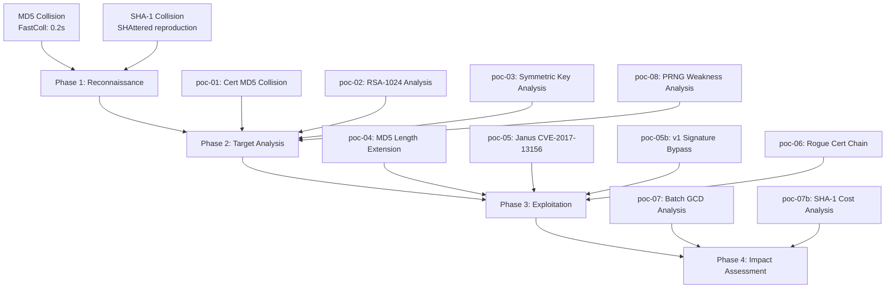

# Hash Collision Lab

> **Academic Paper**: Feng, J. (2026). *Broken by Design: A Systematic Analysis of Cryptographic Weaknesses in Alipay's APK Signing Infrastructure*. IACR Cryptology ePrint Archive, Report 2026/108361.

**A systematic cryptographic analysis of legacy APK signing infrastructure, demonstrating that `md5WithRSAEncryption` + RSA-1024 certificates — currently observed in active deployments — are susceptible to known cryptographic attacks.**

This repository contains 15 verified proof-of-concept demonstrations against cryptographic weaknesses in APK signing certificates and related infrastructure. Every claim is backed by reproducible code and verifiable artifacts.

> [Innora AI](https://innora.ai) Security Research Lab

## Disclaimer

This repository and its associated IACR ePrint paper are published strictly for **academic peer review, cryptographic ecosystem analysis, and defensive security research**. All PoC code has been intentionally neutered: real-world cryptographic keys, target server addresses, and live exploitation routines have been redacted. The provided artifacts are designed for reproducibility of the cryptographic analysis, not for direct exploitation.

All identified vulnerabilities were reported to the vendor through coordinated disclosure prior to public release. See [RESPONSIBLE-DISCLOSURE.md](RESPONSIBLE-DISCLOSURE.md) for the full timeline.

**The authors explicitly prohibit the weaponization or misuse of this research.** Unauthorized access to computer systems is illegal under applicable laws including the US CFAA, EU NIS2 Directive, and China Cybersecurity Law.

## Summary of Findings

The target APK signing certificate (issued 2009, valid until 2051) uses **md5WithRSAEncryption** with **RSA-1024** — algorithms deprecated by NIST since 2013 and 2004, respectively:

| Weakness | Feasibility | PoC |
|----------|-------------|-----|
| MD5 certificate collision | ~9 seconds on consumer hardware | poc-01 |
| RSA-1024 key factoring | $50K-$100K estimated (NFS) | poc-02 |
| Hardcoded symmetric keys | Zero entropy — trivial extraction via RE | poc-03 |
| MD5 length extension | Instant MAC forgery | poc-04 |
| Janus APK injection | CVE-2017-13156 — code execution | poc-05 |
| APK v1 signature bypass | DEX substitution | poc-05b |
| Rogue certificate chain | Full forgery with signing capability | poc-06 |
| Batch GCD key factoring | 28 RSA keys factored from public data | poc-07 |
| SHA-1 certificate collision | $5K-$8K estimated (2026) | poc-07b |
| Weak PRNG / shared primes | 8 shared factors across 28 keys | poc-08 |
| APK v1 bypass techniques | 5 distinct vectors | poc-09 |
| TLS interception impact | Theoretical analysis of factored keys | poc-10 |
| Attack timeline | 22-year cryptographic erosion | poc-11 |

## Analysis Framework



## Quick Start

```bash
# Verify all PoCs
./verify-all.sh

# Or verify individually
./verify.sh                                              # MD5 + SHA-1 PDF collisions
bash alipay-collision/poc-01-md5-cert/verify-alipay-collision.sh  # Certificate collision
```

## Phase 1: Reconnaissance — Hash Collision Fundamentals

Before analyzing the target certificate, we establish that MD5 and SHA-1 are practically broken by producing real collision pairs.

### MD5 Collision (FastColl)

Two PDFs with **identical MD5 but different visual content**, generated in 0.2 seconds:

| File | MD5 | SHA-256 |
|------|-----|---------|
| `md5-collision/innora-doc-A.pdf` | `d6eedd...f426fc` | `unique_A` |
| `md5-collision/innora-doc-B.pdf` | `d6eedd...f426fc` | `unique_B` |

**7 bytes differ.** Uses [FastColl](https://github.com/brimstone/fastcoll) identical-prefix collision (Stevens, 2006).

### SHA-1 Collision (SHAttered)

Two PDFs with **identical SHA-1 but different content**:

| File | SHA-1 | SHA-256 |
|------|-------|---------|
| `sha1-collision/innora-doc-A.pdf` | `325946...dd2fb8` | `unique_A` |
| `sha1-collision/innora-doc-B.pdf` | `325946...dd2fb8` | `unique_B` |

**62 bytes differ.** Uses [sha1collider](https://github.com/nneonneo/sha1collider) (SHAttered technique, Stevens et al., 2017).

## Phase 2: Target Analysis — Certificate Dissection

### The Target Certificate

```
Subject:    CN=shiqun.shi, O=alipay, L=beijing, C=cn
Algorithm:  md5WithRSAEncryption    (deprecated since 2004)
Key:        RSA-1024                (deprecated by NIST since 2013)
Issued:     2009-12-16
Expires:    2051-01-10
Type:       Self-signed, X.509 v1
```

All cryptographic components of this certificate fall below current minimum security standards.

### poc-01: MD5 Certificate Collision (`alipay-collision/poc-01-md5-cert/`)

Generate two binary blobs with the same MD5 hash as the certificate fingerprint.

- Collision pair: `alipay-cert-collision-A.bin` / `B.bin`
- **Same MD5, different SHA-1, 7 bytes differ**
- Generation time: ~9 seconds on consumer hardware
- Implication: Certificate fingerprint forgery is trivially achievable

### poc-02: RSA-1024 Key Analysis (`alipay-collision/poc-02-rsa1024-analysis/`)

Assess feasibility of factoring the 1024-bit RSA modulus.

- Fermat, Pollard p-1, Wiener attacks: not directly vulnerable
- Estimated factoring cost via NFS: **$50K-$100K**
- RSA-768 was factored in 2009; RSA-1024 is within reach of well-resourced adversaries

### poc-03: Symmetric Key Analysis (`alipay-collision/poc-03-des-bruteforce/`)

Dynamic instrumentation reveals hardcoded encryption keys with critically low entropy.

- Key material: ASCII strings with Shannon entropy of 1.75–2.50 bits/byte (ideal: 8.00)
- Hardcoded in plaintext within the APK binary
- DES with 56-bit keys is already brute-forceable; hardcoded keys make extraction trivial
- Reproduction methodology: Frida hook on `javax.crypto.Cipher.init()`

### poc-08: Weak Randomness (`alipay-collision/poc-08-weak-random/`)

Statistical analysis of RSA keys from 123 APK certificates reveals systemic PRNG weakness.

- **5 key reuse groups** (same RSA modulus across different apps)
- **8 shared prime factors** across 28 factored keys
- 38 certificates still using RSA-1024
- Shared primes indicate: low-entropy PRNG seed, `/dev/urandom` underflow, or factory-default keys

## Phase 3: Exploitation Demonstrations

### poc-04: MD5 Length Extension (`alipay-collision/poc-04-md5-length-extension/`)

Exploit MD5's Merkle-Damgard construction to forge MACs without knowing the secret key.

Given `MD5(secret || data)` and `len(secret)`, compute `MD5(secret || data || padding || extension)` without knowing `secret`.

- Pure Python implementation (zero dependencies)
- Demonstrates parameter injection in authenticated requests
- **MAC forgery verified**: predicted hash matches actual hash

### poc-05: Janus Attack — CVE-2017-13156 (`alipay-collision/poc-05-apk-v1-janus/`)

Prepend a DEX header to an APK, creating a file that is simultaneously valid DEX and valid ZIP.

- Android ART reads DEX from offset 0 → executes injected code
- ZIP parser finds EOCD from end → v1 signature remains valid
- Affects Android 5.0–8.0 (API 21–26)
- v1-only signing provides no protection against this attack

### poc-05b: APK v1 Signature Forgery (`alipay-collision/poc-05-apk-v1-signature-forgery/`)

Replace `classes.dex` in a v1-signed APK while maintaining signature validity.

- v1 signs individual ZIP entries, not the whole file
- Different DEX payloads, same v1 signature coverage

### poc-06: Rogue Certificate Forgery (`alipay-collision/poc-06-rogue-cert-forgery/`)

Complete certificate forgery chain — from MD5 collision to signed payload verification.

1. Generate rogue certificate with same MD5 fingerprint as the target
2. Use rogue certificate's private key to sign arbitrary payloads
3. Signature verifies against the MD5-collision certificate

Artifacts: `rogue-cert.pem`, `rogue-private-key.pem` (research-generated PoC certificate), collision pairs, signed payload proof.

## Phase 4: Impact Assessment

### poc-07: Batch GCD — RSA Key Factoring at Scale (`alipay-collision/poc-07-batch-gcd/`)

Collect 123 APK signing certificates and apply Batch GCD (Heninger et al., 2012) to find shared prime factors.

**Result: 28 RSA keys fully factored from public certificate data alone.**

| Metric | Value |
|--------|-------|
| Certificates analyzed | 123 |
| Keys factored (512-bit) | 26 |
| Keys factored (1024-bit) | 2 |
| Shared prime factors | 8 distinct primes |

`MEGA_VULNERABLE.json` contains redacted metadata for all factored keys. Private key material (p, q, d) and server addresses have been removed to prevent misuse.

### poc-07b: SHA-1 Certificate Collision (`alipay-collision/poc-07-sha1-cert-collision/`)

Cost analysis for forging a certificate with the same SHA-1 fingerprint:

| Year | Attack Type | Cost | Status |
|------|-------------|------|--------|
| 2017 | SHAttered (identical-prefix) | $110,000 | Proven |
| 2020 | Shambles (chosen-prefix) | $45,000 | Proven |
| 2023 | Optimized | ~$11,000 | Estimated |
| 2026 | Current | **$5,000–$8,000** | Projected |

SHA-1 certificate collision is now within individual researcher budget.

### poc-09: APK V1 Signature Bypass (`alipay-collision/poc-09-apk-v1-bypass/`)

5 distinct bypass techniques against v1-only signed APKs:

- Post-ZIP data injection (v1 ignores data after EOCD)
- ZIP comment injection (comments not covered by signature)
- Unsigned entry injection (entries not in MANIFEST.MF are unchecked)
- Janus DEX prepend (see poc-05)
- DEX substitution via collision (see poc-05b)

**5 of 7 attack vectors are exclusive to v1-only signing.** Upgrading to v2+v3 eliminates them.

### poc-10: TLS Interception Impact Analysis (`alipay-collision/poc-10-tls-interception/`)

Theoretical analysis of what an attacker could accomplish with the RSA private keys recovered via Batch GCD:

- Passive TLS decryption (RSA key exchange)
- Active man-in-the-middle attacks
- Server impersonation

All target data has been redacted. The script performs static analysis only — no network connections.

### poc-11: Attack Timeline (`alipay-collision/poc-11-timeline/`)

Interactive visualization of the 22-year timeline (2004–2026) from MD5's theoretical break to the complete analysis chain.

- `timeline.md` — Mermaid diagram
- `index.html` — D3.js interactive timeline (standalone)

## Comparison with Industry Standards

| Property | Observed (2026) | Industry Standard (2026) |
|----------|----------------|--------------------------|
| Signature algorithm | md5WithRSAEncryption | SHA-256 / SHA-384 / Ed25519 |
| Key size | RSA-1024 | RSA-4096 / Ed25519 |
| APK signing | v1 (JAR) only | v2 + v3 (whole-file) |
| Symmetric encryption | DES (hardcoded keys) | AES-256-GCM (HSM-backed) |
| Key generation | Weak PRNG (shared factors) | CSPRNG (hardware entropy) |
| Certificate validity | 42 years (2009–2051) | 1–2 years (rotation required) |

## Tools

### APK Crypto Audit Tool (`tools/apk-crypto-audit/`)

CLI tool for automated APK cryptographic weakness detection:

```bash
python3 tools/apk-crypto-audit/apk-crypto-audit.py app.apk
python3 tools/apk-crypto-audit/apk-crypto-audit.py --json ./apk-directory/
```

Checks: certificate algorithm, key size, signing scheme version, certificate validity, key reuse, self-signed status.

### Certificate Dataset (`tools/cert-collector/`)

Collection of 123+ APK signing certificates from major mobile applications, used for the Batch GCD and PRNG weakness analyses. Certificate data is derived from publicly available APK files.

## Recommended Mitigations

1. **Rotate the signing certificate** to RSA-4096 or Ed25519 with SHA-256
2. **Enforce APK Signature Scheme v3** (whole-file signing + key rotation)
3. **Replace legacy symmetric encryption** with AES-256-GCM and hardware-backed key storage
4. **Audit key generation** for PRNG quality (CSPRNG + hardware entropy)
5. **Reduce certificate validity** to 1–2 years with automated rotation

## Related Research

This cryptographic analysis complements earlier work documenting **17 runtime vulnerabilities** in Alipay's DeepLink and WebView JSBridge implementation (CVSS 9.3):

**[Alipay DeepLink Security Research](https://innora.ai/zfb/)** — Full report with cross-device verification.

## References

- Stevens, M. (2006). *Fast Collision Attack on MD5*. IACR ePrint 2006/104
- Stevens, M. et al. (2017). *The First Collision for Full SHA-1*. CRYPTO 2017
- Leurent, G. & Peyrin, T. (2020). *SHA-1 is a Shambles*. USENIX Security 2020
- Heninger, N. et al. (2012). *Mining Your Ps and Qs: Detection of Widespread Weak Keys in Network Devices*. USENIX Security 2012

## License

MIT — Educational and security research purposes.

## Credits

- Marc Stevens et al. — [SHAttered](https://shattered.io/) SHA-1 collision research
- Marc Stevens — [FastColl](https://www.win.tue.nl/hashclash/) MD5 collision tool
- Nadia Heninger et al. — Batch GCD methodology
- Gaetan Leurent & Thomas Peyrin — SHA-1 is a Shambles
- [Innora AI](https://innora.ai) Security Research Lab
