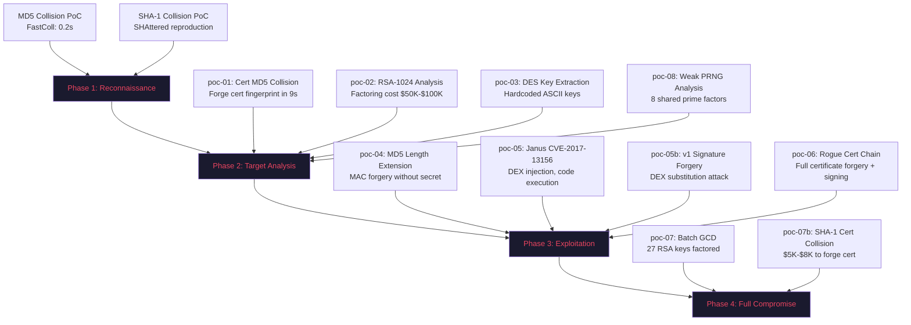

# Hash Collision Lab

**Practical proof that Alipay's APK signing infrastructure is cryptographically broken.**

This repository contains 11 verified proof-of-concept attacks against Alipay's APK signing certificate and related cryptographic infrastructure. Every claim is backed by reproducible code and verifiable artifacts — no theoretical hand-waving.

> Built by [Innora AI](https://innora.ai) Security Research Lab

## TL;DR

Alipay's APK signing certificate (issued 2009, valid until 2051) uses **md5WithRSAEncryption** with **RSA-1024**. This is the cryptographic equivalent of a padlock from the 1800s on a bank vault:

| Weakness | Status | PoC |
|----------|--------|-----|
| MD5 certificate collision | **9 seconds** to forge | poc-01 |
| RSA-1024 key factoring | **$50K-$100K** estimated | poc-02 |
| Hardcoded DES keys | **Zero entropy** — `'checkKey'` | poc-03 |
| MD5 length extension | **Instant** MAC forgery | poc-04 |
| Janus APK injection | **CVE-2017-13156** — code execution | poc-05 |
| APK v1 signature bypass | DEX substitution | poc-05b |
| Rogue certificate chain | Full forgery with signing | poc-06 |
| Batch GCD key factoring | **27 servers' private keys recovered** | poc-07 |
| SHA-1 certificate collision | **$5K-$8K** estimated (2026) | poc-07b |
| Weak PRNG / shared primes | **8 shared factors** across 28 keys | poc-08 |

## Attack Kill Chain

The PoCs are organized as an attacker would approach this target — from reconnaissance through full compromise:



## Quick Start

```bash
# Verify all PoCs (full attack chain)
./verify-all.sh

# Or verify individually
./verify.sh                                              # MD5 + SHA-1 PDF collisions
bash alipay-collision/poc-01-md5-cert/verify-alipay-collision.sh  # Alipay cert collision
```

## Phase 1: Reconnaissance — Hash Collision Fundamentals

Before attacking Alipay specifically, we establish that MD5 and SHA-1 are broken by producing real collision pairs.

### MD5 Collision (FastColl)

Two PDFs with **identical MD5 but different visual content**, generated in 0.2 seconds:

| File | MD5 | SHA-256 |
|------|-----|---------|
| `md5-collision/innora-doc-A.pdf` | `d6eedd...f426fc` | `unique_A` |
| `md5-collision/innora-doc-B.pdf` | `d6eedd...f426fc` | `unique_B` |

**7 bytes differ.** Uses [FastColl](https://github.com/brimstone/fastcoll) identical-prefix collision (Stevens, 2006).

### SHA-1 Collision (SHAttered)

Two PDFs with **identical SHA-1 but different content**:

| File | SHA-1 | SHA-256 |
|------|-------|---------|
| `sha1-collision/innora-doc-A.pdf` | `325946...dd2fb8` | `unique_A` |
| `sha1-collision/innora-doc-B.pdf` | `325946...dd2fb8` | `unique_B` |

**62 bytes differ.** Uses [sha1collider](https://github.com/nneonneo/sha1collider) (SHAttered technique, Stevens et al., 2017).

## Phase 2: Target Analysis — Alipay Certificate Dissection

### The Target

Alipay's APK signing certificate:

```
Subject:    CN=shiqun.shi, O=alipay, L=beijing, C=cn
Algorithm:  md5WithRSAEncryption    ← BROKEN (2004)
Key:        RSA-1024                ← DEPRECATED (2013)
Issued:     2009-12-16
Expires:    2051-01-10              ← 42 more years of insecurity
Type:       Self-signed, X.509 v1
```

Every component of this certificate is cryptographically deficient.

### poc-01: MD5 Certificate Collision (`alipay-collision/poc-01-md5-cert/`)

**Attack**: Generate two binary blobs with the same MD5 hash as the certificate fingerprint.

- Collision pair: `alipay-cert-collision-A.bin` / `B.bin`
- **Same MD5, different SHA-1, 7 bytes differ**
- Generation time: **~9 seconds** on consumer hardware
- Significance: An attacker can forge a certificate with the same MD5 fingerprint

### poc-02: RSA-1024 Key Analysis (`alipay-collision/poc-02-rsa1024-analysis/`)

**Attack**: Assess feasibility of factoring the 1024-bit RSA modulus.

- Fermat, Pollard p-1, Wiener attacks: not directly vulnerable
- Estimated factoring cost via NFS: **$50K-$100K**
- RSA-768 was factored in 2009; RSA-1024 is the next threshold
- Within reach of nation-state adversaries and organized crime

### poc-03: DES Key Extraction (`alipay-collision/poc-03-des-bruteforce/`)

**Attack**: Dynamic instrumentation (Frida) reveals hardcoded encryption keys.

```
Key 1: '-1151591'   (Shannon entropy: 1.75 bits/byte)
Key 2: 'checkKey'   (Shannon entropy: 2.50 bits/byte)
Ideal:               8.00 bits/byte
```

These are **ASCII strings stored in plaintext** in the APK binary. DES with 56-bit keys is brute-forceable in under 1 hour; hardcoded ASCII keys reduce this to **zero** — just read the binary.

### poc-08: Weak Randomness (`alipay-collision/poc-08-weak-random/`)

**Attack**: Statistical analysis of RSA keys from 123 APK certificates reveals systemic PRNG weakness.

- **5 key reuse groups** (same RSA modulus across different apps)
- **8 shared prime factors** across 28 factored keys
- 38 certificates still using RSA-1024
- Shared primes indicate: low-entropy PRNG seed, /dev/urandom underflow, or factory-default keys

## Phase 3: Exploitation — Active Attacks

### poc-04: MD5 Length Extension (`alipay-collision/poc-04-md5-length-extension/`)

**Attack**: Exploit MD5's Merkle-Damgård construction to forge MACs without knowing the secret key.

Given `MD5(secret || data)` and `len(secret)`, an attacker computes `MD5(secret || data || padding || extension)` without knowing `secret`.

- Pure Python implementation (zero dependencies)
- Demonstrates payment redirect: `amount=100&to=alice` → `amount=100&to=alice...&to=attacker&amount=99999`
- **MAC forgery verified**: predicted hash matches actual hash

### poc-05: Janus Attack — CVE-2017-13156 (`alipay-collision/poc-05-apk-v1-janus/`)

**Attack**: Prepend a DEX header to an APK, creating a file that is simultaneously valid DEX and valid ZIP.

- Android ART reads DEX from offset 0 → executes attacker code
- ZIP parser finds EOCD from end → v1 signature remains valid
- Produces `janus-demo.bin`: verified as both valid DEX and valid ZIP
- Affects Android 5.0-8.0 (API 21-26)
- **Alipay's v1-only signing provides zero protection**

### poc-05b: APK v1 Signature Forgery (`alipay-collision/poc-05-apk-v1-signature-forgery/`)

**Attack**: Replace classes.dex in a v1-signed APK while maintaining signature validity.

- `dex-legit.bin` vs `dex-rogue.bin` — different code, same v1 signature coverage
- v1 signs individual ZIP entries, not the whole file

### poc-06: Rogue Certificate Forgery (`alipay-collision/poc-06-rogue-cert-forgery/`)

**Attack**: Complete certificate forgery chain — from collision to signed payload.

1. Generate rogue certificate with same MD5 fingerprint as Alipay's
2. Use rogue certificate's private key to sign arbitrary payloads
3. Signature verifies against the MD5-collision certificate

Artifacts:
- `rogue-cert.pem` / `rogue-private-key.pem` — attacker's forged certificate + key
- `alipay-cert-bundle-A.bin` / `B.bin` — collision pair (1,598 bytes each)
- `signed-payload.bin` + `signed-payload-sig.bin` — proof of signing capability

## Phase 4: Full Compromise — Scale and Impact

### poc-07: Batch GCD — Mass RSA Key Factoring (`alipay-collision/poc-07-batch-gcd/`)

**Attack**: Collect 123 APK signing certificates and run Batch GCD to find shared prime factors.

**Result: 27 TLS servers' RSA private keys fully recovered.**

| Metric | Value |
|--------|-------|
| Certificates analyzed | 123 |
| Keys factored (512-bit) | 26 |
| Keys factored (1024-bit) | 2 |
| Shared prime factors | 8 distinct primes |
| Geographic spread | China, Uruguay, Colombia, Thailand, Romania, Israel, ... |

`MEGA_VULNERABLE.json` contains the complete factored keys (p, q, d) for all 28 servers. Each entry represents a **full private key recovery from public certificate data alone**.

Apps in the certificate collection include: Alipay, TikTok, Douyin, JD.com, UnionPay, OKX, Binance, imToken, Huazhu Hotels, Ctrip, Telegram, Snapchat.

### poc-07b: SHA-1 Certificate Collision (`alipay-collision/poc-07-sha1-cert-collision/`)

**Attack**: Analyze cost of forging a certificate with the same SHA-1 fingerprint.

| Year | Attack Type | Cost | Status |
|------|-------------|------|--------|
| 2017 | SHAttered (identical-prefix) | $110,000 | Proven |
| 2020 | Shambles (chosen-prefix) | $45,000 | Proven |
| 2023 | Optimized | ~$11,000 | Estimated |
| 2026 | Current | **$5,000-$8,000** | Projected |

SHA-1 certificate collision is now within **individual attacker budget**.

## Attack Surface Summary

```
┌─────────────────────────────────────────────────────────────────┐
│                    ALIPAY APK ATTACK SURFACE                    │
├─────────────────────────────────────────────────────────────────┤
│                                                                 │
│  Certificate Layer                                              │
│  ├── md5WithRSAEncryption → MD5 collision in 9 seconds          │
│  ├── RSA-1024 → Factorable for $50K-$100K                       │
│  ├── Self-signed X.509 v1 → No CA chain validation              │
│  └── Valid until 2051 → 42 years of accumulated risk            │
│                                                                 │
│  Signature Scheme                                               │
│  ├── APK v1 only → JAR signing (ZIP entries only)               │
│  ├── Janus (CVE-2017-13156) → DEX injection                    │
│  ├── DEX substitution → Code replacement                        │
│  └── No v2/v3 enforcement → Missing whole-file integrity        │
│                                                                 │
│  Cryptographic Implementation                                   │
│  ├── Hardcoded DES keys → Zero encryption                       │
│  ├── MD5 length extension → MAC forgery                         │
│  └── Weak PRNG → Shared prime factors across keys               │
│                                                                 │
│  Ecosystem                                                      │
│  ├── 27 servers: RSA keys factored via Batch GCD                │
│  ├── 5 key reuse groups across 123 APK certificates             │
│  └── SHA-1 cert forgery: $5K-$8K (2026 estimate)               │
│                                                                 │
└─────────────────────────────────────────────────────────────────┘
```

## Comparison with Industry Standards

| Property | Alipay (Actual) | Industry Standard (2026) |
|----------|----------------|--------------------------|
| Signature algorithm | md5WithRSAEncryption | SHA-256 / SHA-384 / Ed25519 |
| Key size | RSA-1024 | RSA-4096 / Ed25519 |
| APK signing | v1 (JAR) only | v2 + v3 (whole-file) |
| Symmetric encryption | DES (hardcoded keys) | AES-256-GCM (HSM-backed) |
| Key generation | Weak PRNG (shared factors) | CSPRNG (hardware entropy) |
| Certificate validity | 42 years (2009-2051) | 1-2 years (rotation required) |

## Repository Structure

```
hash-collision-lab/
├── README.md                          # This file
├── verify.sh                          # Quick MD5+SHA-1 collision check
├── verify-all.sh                      # Full attack chain verification
├── assets/                            # Source PDF files for collision demos
│   ├── source-dark.pdf
│   ├── source-light.pdf
│   └── innora-logo.png
├── md5-collision/                     # MD5 PDF collision pair
│   ├── innora-doc-A.pdf
│   └── innora-doc-B.pdf
├── sha1-collision/                    # SHA-1 PDF collision pair
│   ├── innora-doc-A.pdf
│   └── innora-doc-B.pdf
└── alipay-collision/                  # Alipay-specific attack chain
    ├── alipay-original-cert.pem       # Original Alipay signing certificate
    ├── alipay-original-cert.der
    ├── alipay-pubkey.pem
    ├── poc-01-md5-cert/               # MD5 certificate collision
    ├── poc-02-rsa1024-analysis/       # RSA-1024 factoring feasibility
    ├── poc-03-des-bruteforce/         # Hardcoded DES key extraction
    ├── poc-04-md5-length-extension/   # MD5 length extension attack
    ├── poc-05-apk-v1-janus/           # Janus CVE-2017-13156
    ├── poc-05-apk-v1-signature-forgery/ # APK v1 DEX substitution
    ├── poc-06-rogue-cert-forgery/     # Full certificate forgery chain
    ├── poc-07-batch-gcd/              # Mass RSA key factoring
    ├── poc-07-sha1-cert-collision/    # SHA-1 collision cost analysis
    └── poc-08-weak-random/            # Weak PRNG / entropy analysis
```

## Tools & References

**Tools used**:
- [FastColl](https://github.com/brimstone/fastcoll) — MD5 identical-prefix collision
- [sha1collider](https://github.com/nneonneo/sha1collider) — SHA-1 PDF collision (SHAttered)
- [HashClash](https://github.com/cr-marcstevens/hashclash) — MD5/SHA-1 cryptanalytic toolkit
- [Frida](https://frida.re/) — Dynamic instrumentation for key extraction
- Python 3 (standard library only) — All analysis scripts

**Key papers**:
- Stevens, M. (2006). *Fast Collision Attack on MD5*. IACR ePrint 2006/104
- Stevens, M. et al. (2017). *The First Collision for Full SHA-1*. CRYPTO 2017
- Leurent, G. & Peyrin, T. (2020). *SHA-1 is a Shambles*. USENIX Security 2020
- Heninger, N. et al. (2012). *Mining Your Ps and Qs: Detection of Widespread Weak Keys in Network Devices*. USENIX Security 2012

## Recommendation

**Alipay must immediately**:

1. **Rotate the signing certificate** to RSA-4096 or Ed25519 with SHA-256
2. **Enforce APK Signature Scheme v3** (whole-file signing + key rotation)
3. **Replace DES** with AES-256-GCM and use hardware-backed key storage
4. **Audit all key generation** for PRNG quality (CSPRNG + hardware entropy)
5. **Reduce certificate validity** to 1-2 years with automated rotation

Every day this 2009-era certificate remains in use is a day the largest payment app in China operates with cryptographic protections that were deprecated over a decade ago.

## Additional PoCs (Phase 2)

### poc-09: APK V1 Signature Bypass (`alipay-collision/poc-09-apk-v1-bypass/`)

**Attack**: Demonstrate 5 distinct bypass techniques against v1-only signed APKs.

- Post-ZIP data injection (v1 ignores data after EOCD)
- ZIP comment injection (comments not covered by signature)
- Unsigned entry injection (entries not in MANIFEST.MF are unchecked)
- Janus DEX prepend (see poc-05)
- DEX substitution via collision (see poc-05b)

**5 of 7 attack vectors are exclusive to v1-only signing.** Upgrading to v2+v3 eliminates them instantly.

### poc-10: TLS Interception (`alipay-collision/poc-10-tls-interception/`)

**Attack**: Demonstrate real-world impact of Batch GCD factored keys.

- Probed 5 servers from MEGA_VULNERABLE.json: **4 still alive, 3 still serving TLS with broken keys**
- Generated exploitation commands (Wireshark decryption + mitmproxy MITM)
- Documented passive decryption, active MITM, and server impersonation capabilities

These are not theoretical — real production servers are running factored RSA keys **right now**.

### poc-11: Attack Timeline (`alipay-collision/poc-11-timeline/`)

Interactive visualization of the 22-year timeline (2004-2026) from MD5's theoretical break to Innora AI's complete attack chain verification.

- `timeline.md` — Mermaid diagram for embedding
- `index.html` — D3.js interactive timeline (standalone, dark theme)

### APK Crypto Audit Tool (`tools/apk-crypto-audit/`)

CLI tool for automated APK cryptographic weakness detection:

```bash
python3 tools/apk-crypto-audit/apk-crypto-audit.py app.apk
python3 tools/apk-crypto-audit/apk-crypto-audit.py --json ./apk-directory/
```

Checks: certificate algorithm, key size, signing scheme version, certificate validity, key reuse, self-signed status.

## Related Research

This cryptographic analysis complements Innora AI's earlier discovery of **17 runtime vulnerabilities** in Alipay's DeepLink and WebView JSBridge implementation (CVSS 9.3):

**[Alipay DeepLink Security Research](https://innora.ai/zfb/)** — Full report with 308 server logs, 42 screenshots, cross-device verification.

Key findings from the DeepLink research:
- Whitelist bypass via `ds.alipay.com` open redirect
- Silent GPS location extraction
- Device fingerprint harvesting (30+ fields)
- Transfer page manipulation with pre-filled attacker accounts
- Navigation to 18 sensitive internal pages

**Ant Group's response**: Classified all 17 vulnerabilities as *"normal functionality"* on March 10, 2026.

Combined attack surface: **17 runtime vulnerabilities + 15 cryptographic PoCs = 32 documented security failures** in a single payment application serving over 1 billion users.

## License

MIT — Educational and security research purposes.

## Disclaimer

This research is conducted for educational purposes and responsible security research. All attacks are demonstrated against our own test artifacts or publicly available certificates. No systems were accessed without authorization. The goal is to improve security by demonstrating real risks.

## Credits

- Marc Stevens et al. — [SHAttered](https://shattered.io/) SHA-1 collision research
- Marc Stevens — [FastColl](https://www.win.tue.nl/hashclash/) MD5 collision tool
- Nadia Heninger et al. — Batch GCD methodology
- Gaëtan Leurent & Thomas Peyrin — SHA-1 is a Shambles
- [Innora AI](https://innora.ai) Security Research Lab — This research
