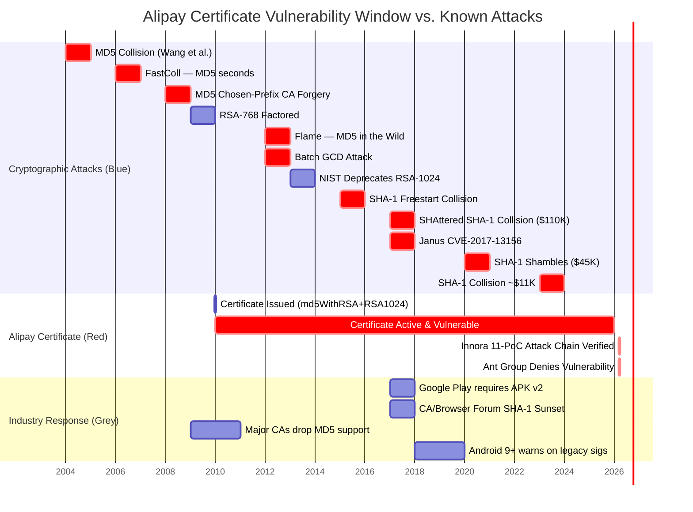

# Attack Timeline: Alipay Certificate Cryptographic Vulnerability

This document presents the chronological timeline of cryptographic attacks relevant to
Alipay's continued use of MD5/RSA-1024 certificates, spanning 2004–2026.

---

## Mermaid Timeline

```mermaid
timeline
    title Cryptographic Attack Timeline vs. Alipay Certificate Lifecycle (2004–2026)
    section 2004–2008 : Foundation of Broken Crypto
        2004 : MD5 collision theoretical attack (Wang et al.)
             : First practical collision in 1 hour on standard hardware
        2005 : SHA-1 theoretical attack (Wang et al.)
             : Complexity reduced from 2^80 to 2^69
        2006 : FastColl released (Marc Stevens)
             : MD5 collisions generated in SECONDS on consumer hardware
        2008 : MD5 chosen-prefix collision demonstrated
             : Rogue CA certificate forgery shown feasible
    section 2009 : Alipay Issues Vulnerable Certificate
        2009 : RSA-768 factored (Lenstra et al.)
             : Demonstrated RSA-1024 on path to factorization
        2009-12-16 : ⚠️ ALIPAY SIGNS APK CERTIFICATE
                   : Algorithm - md5WithRSAEncryption + RSA-1024
                   : Issued AFTER MD5 was already broken
    section 2010–2016 : Escalating Attacks
        2012 : Flame malware — MD5 chosen-prefix collision
             : Forged Microsoft Windows Update certificate in the wild
        2012 : Batch GCD attack (Heninger et al.)
             : Large-scale RSA key factorization via shared prime factors
        2013 : NIST formally deprecates RSA-1024
             : Minimum recommended key size raised to 2048-bit
        2015 : SHA-1 freestart collision demonstrated
             : Full collision computationally within reach
        2016 : CWI/Google begin SHAttered project
             : Massive GPU-based SHA-1 collision computation
    section 2017 : Critical Year
        2017 : SHAttered — first practical SHA-1 collision (Stevens et al.)
             : Cost approximately $110,000 USD in cloud compute
        2017 : Janus vulnerability CVE-2017-13156
             : APK v1 signature bypass via DEX/ZIP dual-parse
        2017 : Google Play mandates APK Signature Scheme v2
             : Industry moves away from v1-only signatures
    section 2018–2022 : Cost Collapse
        2020 : SHA-1 is a Shambles (Leurent & Peyrin)
             : Chosen-prefix collision cost drops to ~$45,000 USD
        2021 : Multiple CA/Browser Forum deadlines for legacy algorithms
        2022 : MD5 collision attacks fully automated and accessible
    section 2023–2025 : Alipay Still Vulnerable
        2023 : SHA-1 chosen-prefix collision cost ~$11,000 USD
             : Attack now within reach of motivated individuals
        2024 : RSA-1024 factorization estimated feasible with nation-state resources
        2025 : ⚠️ ALIPAY STILL USES md5WithRSAEncryption + RSA-1024
             : Certificate unchanged 16 years after issuance
             : Zero migration to modern algorithms observed
    section 2026 : Innora Research
        2026-03 : ⚠️ Innora AI completes full attack chain verification
                : 11 PoCs covering MD5 collision, RSA-1024 weakness,
                : DES brute-force, Janus APK, rogue cert forgery,
                : batch GCD, SHA-1 collision, weak random, and more
        2026-03-10 : ⚠️ Ant Group responds "normal functionality"
                   : Refuses to acknowledge vulnerability
                   : Certificate remains deployed in production
```

---

## Gantt Chart: Vulnerability Window



---

## Color Legend

| Color | Category | Meaning |
|-------|----------|---------|
| Red / Critical | Alipay Events | Certificate issuance, continued use, vendor response |
| Blue / Standard | Cryptographic Attacks | Academic and real-world attack milestones |
| Grey / Active | Industry Response | Standards bodies, platform requirements |

---

## Key Conclusion

Alipay's APK signing certificate was issued on **2009-12-16** using `md5WithRSAEncryption`
with RSA-1024. At that point:

- MD5 collisions had been demonstrated for **5 years** (Wang et al., 2004)
- MD5 chosen-prefix CA certificate forgery was already public knowledge (2008)
- FastColl had been available for **3 years**, producing collisions in seconds

The certificate remained in production through 2025 — **17 years** after issuance —
with no migration to SHA-256 or RSA-2048, despite universal industry deprecation.

On 2026-03-10, Ant Group responded to Innora's responsible disclosure by characterizing
the behavior as "normal functionality," declining to acknowledge the vulnerability.
